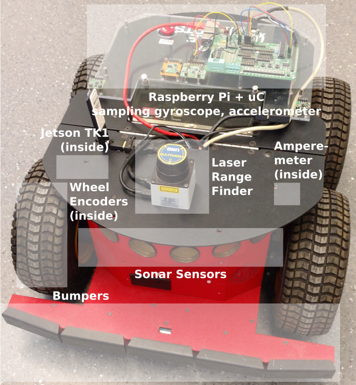
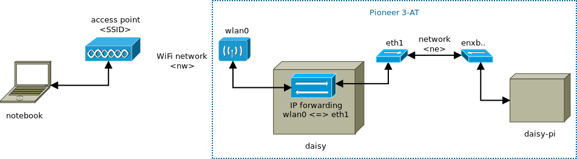

# Daisy

`daisy` is the rover equipped with the highest number of sensors.



* Pioneer 3-AT
* Primary controller: Jetson TK1, hostname `daisy`
  * Jetson TK1 UART2 is connected to the Pioneer's microcontroller running
    P2OS. The serial port for the P2OS connection is `/dev/ttyTHS1`.
  * [ROS Indigo](http://wiki.ros.org/indigo)
    for [ARM](http://wiki.ros.org/NvidiaJetsonTK1) is installed. ROS packages:
    * `ros-indigo-p2os-driver` ([p2os](http://wiki.ros.org/p2os_driver))
    * `ros-indigo-driver-common`,
    * `ros-indigo-hokuyo-node`.
* Aux 1: Raspberry Pi `daisy-pi`
* Aux 2: Hokuyo laser rangefinder
* Secondary controller: Raspberry Pi, hostname `daisy-pi`
  * Ubuntu Mate
  * [ROS Kinetic](http://wiki.ros.org/kinetic)
    for [ARM](http://wiki.ros.org/Installation/UbuntuARM).


## Network Setup

Please do not change the basic networking settings (several students and
employees use the rovers). However, you can propose and implement better
solutions in consultation with Denise.



The Raspberry Pi `daisy-pi` automatically connects to the access point `<SSID>`
over its interface `wlan0` when available and is the gateway of the Jetson
TK1. Denise manages the accounts and connection details (SSID, IPs, username
and password) -> contact for account creation.

[Setup a hotspot](https://wiki.ubuntuusers.de/Howto/Hotspot_auf_PC_einrichten/)
with the appropriate SSID and password. Start the hotspot with
```bash
$ nmcli con up id <hotspot-name>
```

To use `daisy` in a convenient way, follow the instructions of
the [rover network setup](../dagobert-network-setup.md) on the example of
`dagobert`. You can test the network setup with following command (replace
`your-notebook` with the hostname of your PC):

```bash
$ roslaunch pioneer_teleop drive.launch \
    notebook:=your-notebook robot:=daisy \
    robot-distro:=indigo robot-port:=/dev/ttyTHS1
```

### Reach `daisy`

Jetson TK1 `daisy` uses its Ethernet port to communicate to the Raspberry Pi
`daisy-pi`. The Jetson TK1 is therefore in a different network `<ne>` than the
notebook `<nw>`.

[IP forwarding](https://gist.github.com/tzermias/5408466) must be enabled for
the Pi's Ethernet port `eth` to `wlan0`, which is performed by a script at
startup. On the
Jetson~TK1 [set the route](http://linux-ip.net/html/tools-route.html) to the
WLAN network `<nw>`. And vice versa for the notebook (route to Jetson TK1).

Additionally to the settings below, `daisy`, `daisy-pi` and your notebook need
appropriate host name entries in `/etc/hosts` mapping the name to the IP.

#### Settings on `daisy`

Network settings in `/etc/network/interfaces`:
```bash
auto eth1
iface eth1 inet static
  address <ne-daisy-ip>
  netmask 255.255.255.0
  gateway <ne-daisy-pi-ip>
  dns-nameservers 8.8.8.8 8.8.4.4

# Static route
up route add -net <nw-base-ip> netmask 255.255.255.0 gw <ne-diasy-pi-ip>
```

#### Settings on `daisy-pi`

Network settings in `/etc/network/interfaces`:
```bash
# Connection to Jetson TK1
auto enxb827eb4e5821
iface enxb827eb4e5821 inet static
  address <ne-daisy-pi-ip>
  netmask 255.255.255.0
```

Script for IP forwarding:
```bash
#!/bin/sh
# enable ip forwarding
sudo sysctl -w net.ipv4.ip_forward=1
# forward packets from eth to wlan
sudo iptables -A FORWARD --in-interface enxb827eb4e5821 -j ACCEPT
sudo iptables --table nat -A POSTROUTING --out-interface wlan0 -j MASQUERADE
```

Added following snippet to `/etc/rc.local`:
```bash
# ip forwarding
/home/pi/forward_eth_to_wlan.sh &
echo "start ip forwarding: eth -> wlan"
```

The WiFi connection to the access point is setup via the GUI.


#### Settings on `your-notebook`

When you use a hotspot on your notebook, create a route to reach `daisy-pi`.
```bash
# Static route
up route add -net <ne-base-ip> netmask 255.255.255.0 gw <nw-diasy-pi-ip>
```

Set a static IP if you don't create a hotspot but use a router as access point
for example.


## Jetson TK1 Installation

* [Linux for Tegra R21.5](https://developer.nvidia.com/linux-tegra-r215) sample
  file system (follow the quick start guide). However, next time I would try
  the Grinch kernel directly due to missing drivers in the sample file system
  (FTDI, WiFi adapter).
* An additional power button (switch) is installed. (When Linux is shutdown,
  power on is only possible via the button due to a capacitance somewhere at
  the power supply.)
* Installed [driver](http://elinux.org/Jetson/Network_Adapters) for WLAN stick.
* Installed UART2 including level shifter and MAX3232 (see
  also
  [GPS example](http://www.jetsonhacks.com/2015/09/03/level-shifting-uart-and-gps-part-2-nvidia-jetson-tk1/)).
  Note, the visible serial port is just for the serial console.
* Automatically connects to access point `<SSID>`.
* Changed hostname (`/etc/hosts`, `/etc/hostname`)
* Installed `openssh-server`.
* Enabled [IP forwarding](https://gist.github.com/tzermias/5408466) and
  installed IP routes on Pi and notebook.


## Applications and Usage

* [Tracking Daisy](optitrack/README.md)


---
2017-12-01 | Denise Ratasich
